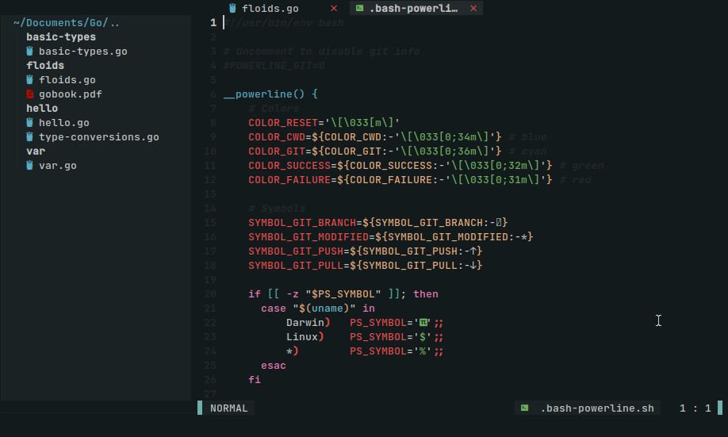
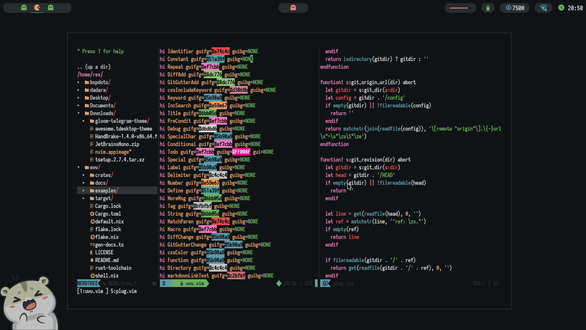

<p align-"center"> 
	
</p>
<p align="center">
A dark independent vim/neovim colorscheme >.< 
</p>

<p align="center"> 
  </a> 
 
  `
</p> 

# Installation 
- ```Plug 'mangeshrex/uwu.vim' ``` 
- Add ```colorscheme uwu``` to .vimrc or init.vim . 

# Setup 
- These settings are important put this in your ```.vimrc``` / ```init.vim```
- ``` 
  set t_Co=256
  let &t_ut=''
  if exists('+termguicolors')
    let &t_8f = "\<Esc>[38;2;%lu;%lu;%lum"
    let &t_8b = "\<Esc>[48;2;%lu;%lu;%lum"
    set termguicolors
  endif

  " Important for colorschemes
  nmap <F5> :call <SID>SynStack()<CR>
  function! <SID>SynStack()
    if !exists("*synstack")
      return
    endif
    echo map(synstack(line('.'), col('.')), 'synIDattr(v:val, "name")')
  endfunc 

# Screenshot 
- Independently with Vim 
 

- uWu with <a href="https://github.com/NvChad/NvChad">NvChad</a> 
 

# Contribute 
- Syntax related and other PR's are welcomed  ❤️ .

