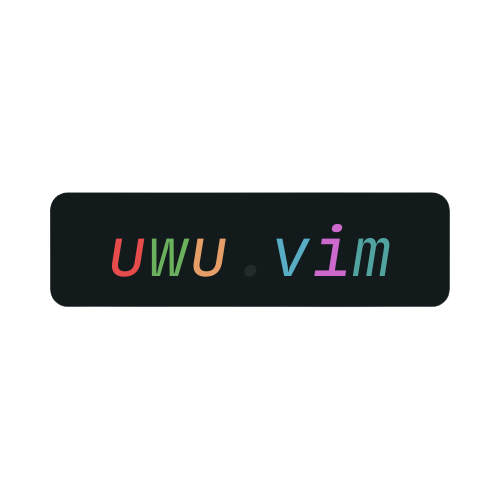

<p align-"center"> 
	
</p>
<p align="center">
A beautiful and dark vim colorscheme >.< 
</p>

<p align="center"> 
   
 
  
</p> 

# Installation 
- Vim-Ply 
- First install . 
- ```Plug 'mangeshrex/uwu.vim' ``` 
- Add ```colorscheme uwu``` to .vimrc or init.vim. 

# Terminal Config
- <a href="https://github.com/mangeshrex/uwu.vim/tree/main/assets/alacritty.yml">Alacritty</a>
- <a href="https://github.com/Mangeshrex/uwu.vim/tree/main/assets/kitty.conf">Kitty</a>
- <a href="https://github.com/Mangeshrex/uwu.vim/tree/main/assets/.Xresources">Xresources</a> 

# Contribute 
- Syntax related and other PR's are welcomed  ❤️ .

# TO-DO 
- [ ] Adding some famous statusline support. 
- [ ] Beautifying the colors more. 
- [ ] Adding support for all other programs + apps. 

At this moment UwU colorscheme is at its beginning and needs to be ported to most of the programs used in day to day life. So, if anyone of you feels you can port it to your favourite programs then PR's heartily welcomed.  


